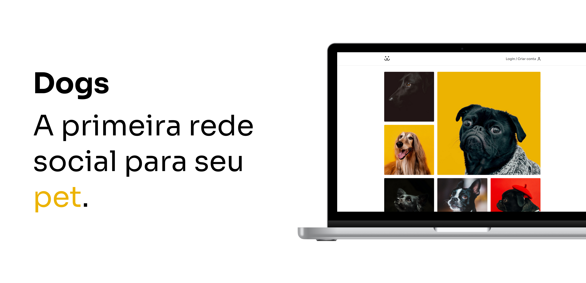

<h1 align="center">
  
</h1>

<h1 align="center">
  
</h1>
<h3 align="center">Você pode acessar o projeto <a href="https://dogs-social-network.vercel.app/" target="_blank">clicando aqui</a></h3>

# Sobre o projeto

<p>Dogs é uma rede social para cachorros. Nele é possível entrar com um usúario já cadastrado, cadastrar novo usúario, recuperar uma senha, postar fotos e comentar. Foi usado o Wordpress como CMS, onde foi feito toda autenticação JWT e a criação dos endpoints customizados para esse projeto.</p>

# Tecnologias

- [ReactJs](https://reactjs.org/)
- [React Router DOM](https://reactrouter.com/)
- [JWT](https://jwt.io/)
- [Victory](https://formidable.com/open-source/victory/)
- [Css Modules](https://github.com/css-modules/css-modules)

## Como baixar o projeto

```bash
# Clonar o repositório
$ git clone https://github.com/wellingtonrodriguesbr/Dogs

# Entrar no diretório
$ cd Dogs


# Instalar as dependências
$ yarn install

# Rodar o projeto
$ yarn start
```

<br/>
<hr/>

<p align="center">Desenvolvido por <a href="https://www.linkedin.com/in/wellingtonrodriguesbr/" target="_blank">Wellington Rodrigues</a> ✌🏽</p>
